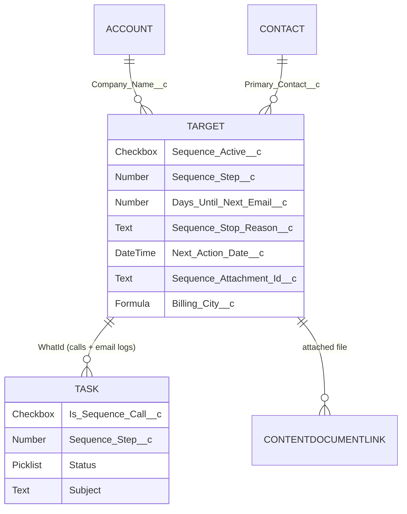
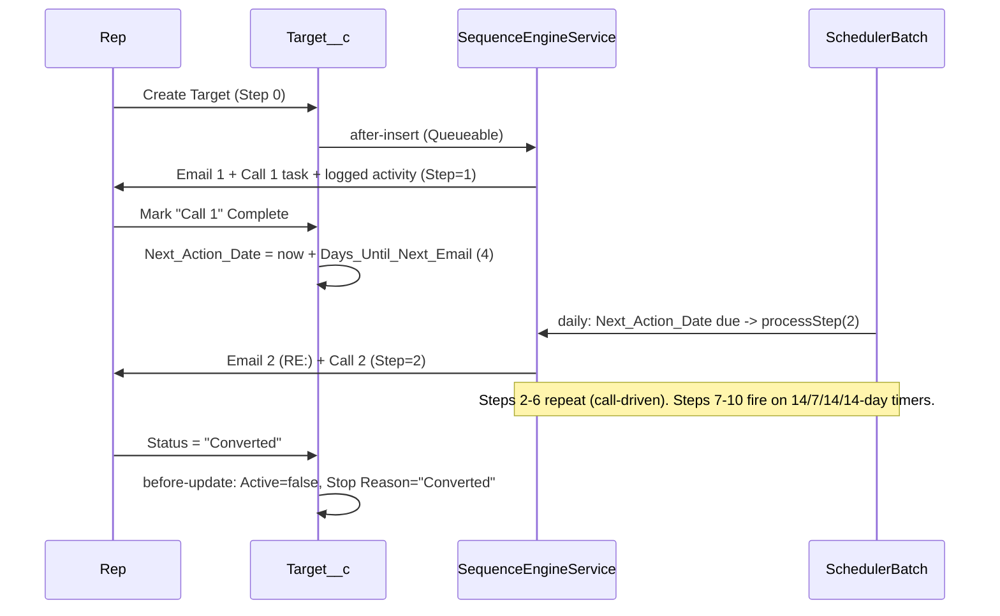

# Target__c Login (Outreach) Sequence — Solution Design

**Author:** Salesforce Solution Architect
**Date:** 2026-06-12
**Status:** Approved design — ready for build
**Platform:** Salesforce, API version 66.0 (Spring '26)

---

## 1. Context

The client runs M&A buy-side outreach on a custom `Target__c` object (acquisition
targets for "Atrium Home Services"). They want an automated **10-step email + call
cadence**: send Email 1 on target creation, then advance through Emails 2–10 with
matching call tasks, governed by a kill switch and an auto-stop when the target's
`Status__c` reaches a terminal value. A record-page LWC lets a rep attach a single file
that rides along on every email.

The client originally drafted this as ~12 separate flows. That violates two
Well-Architected principles — *standard-before-custom done right* and *one automation
path per object/event* (anti-patterns **AU2** / **CP2**):

- The 10 steps are **near-identical** — only the **email template** and **wait time**
  differ. Cloning that logic 10× guarantees drift and high maintenance.
- **Attaching an ad-hoc uploaded file to an outbound email is impossible in Flow.** It
  requires Apex `Messaging.SingleEmailMessage.setEntityAttachments()`.

Therefore the solution is a single **configuration-driven Apex engine**: one Custom
Metadata row per step, a daily scheduler for the waits, thin event-capture triggers, and
one LWC. Adding, removing, or re-timing a step becomes a **metadata edit**, not a code
change.

### Confirmed decisions

| # | Decision | Rationale |
|---|---|---|
| 1 | **Metadata-driven Apex engine** (not 12 flows) | DRY, scalable, admin-tunable; required by the file-attachment constraint |
| 2 | **Primary Contact = Lookup(Contact)** | Send to `Contact.Email`; merge fields pull from both Contact and Target |
| 3 | **Native send via Org-Wide Email Address; "RE:" subject only** | Apex email cannot set `In-Reply-To`/`References` headers — true inbox threading is out of scope (see §8) |

**Architecture standards:** API 66.0 on all metadata · layered **Trigger → Handler →
Service → Selector** · `with sharing` · User-Mode DML/SOQL · bulkified throughout.

---

## 2. Requirement → Design mapping

| Doc feature | Design element |
|---|---|
| **Feature 1** — send Email 1 on create, Step=1 | `TargetTrigger` after-insert → `SequenceStartQueueable` → `SequenceEngineService.processStep(step 1)` |
| **Features 2–6** — Call N complete → wait 4d → Email N+1 | `TaskTrigger` after-update sets `Next_Action_Date__c = now + Days_Until_Next_Email__c`; `SequenceSchedulerBatch` sends when due |
| **Features 7–10** — 14/7/14/14-day timers after step | Engine sets `Next_Action_Date__c = now + Next_Wait_Days__c` from metadata; same batch sends when due |
| **Feature 11** — terminal status → stop + reason | `TargetTrigger` **before-update** sets `Sequence_Active__c=false`, `Sequence_Stop_Reason__c`, clears `Next_Action_Date__c` |
| **Feature 12** — one file on all emails | `targetEmailAttachment` LWC → stores `ContentDocumentId` in `Sequence_Attachment_Id__c`; engine attaches it |
| **Kill switch** (all sends) | Engine re-checks `Sequence_Active__c` before every send; batch query also filters on it |
| **"Log Email N as completed activity"** | Engine inserts a completed `Task` (Type=Email) per send |

> **Key insight:** The doc has an asymmetry — steps 1–6 wait on a **call completion**,
> steps 6–10 run on a **fixed timer**. Both are unified by one field
> (`Next_Action_Date__c`) and one batch. Call completion and timers are just two ways the
> due-date gets populated.

---

## 3. Data Model

### 3.1 New fields on `Target__c`

| Field | Type | Notes |
|---|---|---|
| `Sequence_Active__c` | Checkbox, default **true** | Kill switch (client field #1) |
| `Sequence_Step__c` | Number(2,0), default **0** | Counter 0–10 (client field #2) |
| `Days_Until_Next_Email__c` | Number(3,0), default **4** | Configurable wait for call-driven steps 1–6 (client field #3) |
| `Sequence_Stop_Reason__c` | Text(255) | Auto-stop reason (client field #4) |
| `Next_Action_Date__c` | **DateTime** *(new)* | When the scheduler advances the next step. Drives the batch; add a custom index (filtered with `Sequence_Active__c`) |
| `Primary_Contact__c` | **Lookup(Contact)** *(new)* | Recipient; merge source for `[Primary Contact]` |
| `Sequence_Attachment_Id__c` | Text(18) *(new)* | `ContentDocumentId` chosen by the LWC; blank = send with no attachment |
| `Billing_City__c` | Text **Formula** *(new)* | `= Company_Name__r.BillingCity` — single-hop source for `[Billing City]` |

**Assumed already present:** `Name` (`[Target Name]`), `Status__c` (picklist),
`Company_Name__c` (**Lookup** to the company — assumed **Account**, since `BillingAddress`
is a standard compound field). `[Billing City]` is sourced from
`Company_Name__r.BillingAddress` (the **City** component) — **not** a field directly on
`Target__c`. The `Billing_City__c` cross-object formula keeps the email templates
single-hop. *(Confirm `Company_Name__c` targets `Account`; if it points at a different
object, the relationship path is the same pattern, `Company_Name__r.BillingCity`.)*

### 3.2 New fields on `Task`

| Field | Type | Notes |
|---|---|---|
| `Is_Sequence_Call__c` | Checkbox | Marks engine-created call tasks — robust detection instead of parsing the "Call N" subject string |
| `Sequence_Step__c` | Number(2,0) | Which call number (1–10) the task represents |

### 3.3 Custom Metadata — `Sequence_Step_Config__mdt` (one row per step, 1–10)

| Field | Example (Step 1) | Example (Step 6) |
|---|---|---|
| `Step_Number__c` | 1 | 6 |
| `Email_Template_Dev_Name__c` | `Sequence_Email_1` | `Sequence_Email_6` |
| `Is_Reply__c` (prefix "RE:") | false | true |
| `Call_Task_Subject__c` | `Call 1` | `Call 6` |
| `Call_Due_Offset_Days__c` | 2 | 2 |
| `Next_Trigger_Type__c` (`CallCompleted`/`Timer`/`None`) | `CallCompleted` | `Timer` |
| `Next_Wait_Days__c` (Timer only) | *(blank → use `Days_Until_Next_Email__c`)* | 14 |

Step rows 7 / 8 / 9 use `Next_Wait_Days__c` = 7 / 14 / 14; step 10 = `None`.
**Re-timing the cadence is a metadata edit, no code change.**

### 3.4 Custom Metadata — `Sequence_Terminal_Status__mdt` (Feature 11)

One row per terminal status: `Status_Value__c` (Converted / Meeting Booked / Do Not
Contact / Replied) → `Stop_Reason__c`. Keeps the auto-stop list admin-configurable.

### 3.5 Email Templates

10 **Lightning Email Templates** (`Sequence_Email_1..10`) built from the doc's copy,
with merge fields resolving via `setTargetObjectId(Contact)` + `setWhatId(Target)`:

| Placeholder in doc | Merge field |
|---|---|
| `[Target Name]` | `{{{Target__c.Name}}}` |
| `[Primary Contact]` | `{{{Contact.FirstName}}}` |
| `[Billing City]` | `{{{Target__c.Billing_City__c}}}` (formula field; or `{{{Target__c.Company_Name__r.BillingCity}}}`) |

The "RE:" prefix for Emails 2–10 is applied in Apex from `Is_Reply__c` — keeping **one**
template per step rather than duplicating subject lines.

### 3.6 Files (Feature 12)

Standard `ContentVersion` / `ContentDocumentLink` to the Target record. The LWC enforces
a single file and records the chosen `ContentDocumentId` on `Sequence_Attachment_Id__c`.

### 3.7 ERD (relevant relationships)



---

## 4. Apex Components (Trigger → Handler → Service → Selector)

```
triggers/
  TargetTrigger.trigger            (after insert, before update)
  TaskTrigger.trigger              (after update)   // one-per-object; if a Task trigger
                                                    // already exists, add a handler call instead
classes/
  TargetTriggerHandler.cls         // start sequence (insert); terminal-status stop (before update)
  TaskTriggerHandler.cls           // sequence-call completion → set Next_Action_Date
  SequenceEngineService.cls        // CORE: processStep(), startSequence(), advanceDue(),
                                   //       handleCallCompleted(), handleStatusStop()
  SequenceEmailService.cls         // builds + sends SingleEmailMessage (template, RE:,
                                   //       attachment, OWE address); @InvocableMethod too
  SequenceStepConfigService.cls    // Sequence_Step_Config__mdt.getAll() → Map<Integer,cfg>
  SequenceStartQueueable.cls       // off-trigger send for Feature 1 (keeps trigger fast)
  SequenceSchedulerBatch.cls       // Database.Batchable + Stateful — sends due steps
  SequenceSchedulerSchedulable.cls // daily (or hourly) CRON entry point
  TargetSelector.cls / TaskSelector.cls / ContentSelector.cls   // with sharing, USER_MODE SOQL
  SequenceAttachmentController.cls // @AuraEnabled for the LWC
  + matching *Test.cls for each
lwc/
  targetEmailAttachment/           // single-file upload on the Target record page
```

### 4.1 Engine flow (the heart of it)

`SequenceEngineService.processStep(Target t, Integer stepToSend)`:

1. **Kill-switch guard** — `if (!t.Sequence_Active__c) return;`
2. Load `Sequence_Step_Config__mdt` for `stepToSend`.
3. `SequenceEmailService.send(t, cfg)` — render template, prefix "RE:" if `Is_Reply__c`,
   attach `Sequence_Attachment_Id__c` file if present, set OWE address.
4. Create the **`Call N` Task** (due today + `Call_Due_Offset_Days__c`,
   `Is_Sequence_Call__c=true`, `Sequence_Step__c=N`, `WhatId=Target`).
5. Insert the **completed Email Task** (Type=Email, Status=Completed, `WhatId=Target`).
6. Set `Sequence_Step__c = stepToSend`; schedule the next step from `cfg`:
   - `Next_Trigger_Type__c = Timer` → `Next_Action_Date__c = now + Next_Wait_Days__c`.
   - `= CallCompleted` → `Next_Action_Date__c = null` (waits on the call event).
   - `= None` → leave (sequence complete at step 10).

All steps bulkified: collect emails / tasks / updates across records, single DML each
(`Database.insert(list, AccessLevel.USER_MODE)` with partial-success handling).

### 4.2 Event capture

- **Target after-insert** → `SequenceStartQueueable` → `processStep(step 1)`. Async keeps
  the insert transaction lean and isolates the email work.
- **Task after-update** → if `Is_Sequence_Call__c` **and** Status → `Completed` **and**
  the related Target is at the matching step **and** active → set
  `Next_Action_Date__c = now + Days_Until_Next_Email__c`. The completed **Email** activity
  tasks have `Is_Sequence_Call__c=false`, so they never re-trigger.
- **`SequenceSchedulerBatch`** (daily):
  `SELECT … FROM Target__c WHERE Sequence_Active__c = true AND Next_Action_Date__c <= :now AND Sequence_Step__c < 10`
  → `processStep(step+1)` for each. This single batch realizes **both** the 4-day call
  waits and the 14/7/14/14 timers.
- **Target before-update** (Feature 11) → if `Status__c` changed to a
  `Sequence_Terminal_Status__mdt` value and `Sequence_Active__c=true`: set
  `Sequence_Active__c=false`, `Sequence_Stop_Reason__c=Stop_Reason__c`, clear
  `Next_Action_Date__c`. Before-save = same-record update, **no extra DML**.

---

## 5. Process / Interaction diagram



---

## 6. Cadence timeline (steps at a glance)

| Step | Email | Trigger to enter this step | Wait source | Call task |
|---|---|---|---|---|
| 1 | Email 1 | Target created | immediate | Call 1 (due +2d) |
| 2 | Email 2 (RE:) | Call 1 completed | `Days_Until_Next_Email__c` (4) | Call 2 |
| 3 | Email 3 (RE:) | Call 2 completed | `Days_Until_Next_Email__c` (4) | Call 3 |
| 4 | Email 4 (RE:) | Call 3 completed | `Days_Until_Next_Email__c` (4) | Call 4 |
| 5 | Email 5 (RE:) | Call 4 completed | `Days_Until_Next_Email__c` (4) | Call 5 |
| 6 | Email 6 (RE:) | Call 5 completed | `Days_Until_Next_Email__c` (4) | Call 6 |
| 7 | Email 7 (RE:) | Timer after step 6 | **14 days** | Call 7 |
| 8 | Email 8 (RE:) | Timer after step 7 | **7 days** | Call 8 |
| 9 | Email 9 (RE:) | Timer after step 8 | **14 days** | Call 9 |
| 10 | Email 10 (RE:) | Timer after step 9 | **14 days** | Call 10 |

---

## 7. LWC — `targetEmailAttachment` (Feature 12)

- Sits on the `Target__c` record page. `lightning-file-upload` limited to **one file**;
  on upload it links a `ContentVersion` to the record and calls
  `setAttachment(recordId, contentDocumentId)`, which stamps `Sequence_Attachment_Id__c`
  and removes any prior sequence file link (enforces "only one").
- Shows the current file name + a Remove button (`removeAttachment` clears the field).
- Reads via `@wire` / `@AuraEnabled(cacheable=true) getCurrentAttachment`. Imperative
  Apex uses `async/await` + `try/catch/finally`, a `lightning-spinner` during upload, and
  `ShowToastEvent` for feedback. Uses `lwc:if`, lowercase event names, and `lightning-*`
  base components. Jest test included.
- If `Sequence_Attachment_Id__c` is blank, the engine sends **without** an attachment
  (per the doc).

---

## 8. Email "replies" / threading (decision + rationale)

The doc wants Emails 2–10 to read as "replies" (subjects start with "RE:"). This is a
reply-rate tactic, not a hard technical spec. **Recommended path: native send, "RE:"
subject only** — accepted with eyes open:

- Native Salesforce / Apex email **cannot set `In-Reply-To` / `References` headers**, so
  Emails 2–10 carry "RE:" subjects but do **not** genuinely thread in the recipient's
  inbox.
- A transactional provider (SendGrid / SES / Mailgun) *could* set those headers, but it is
  the **wrong tool for cold 1:1 prospecting**: reputation / warm-up risk, added
  integration cost, and it does **not** send from the rep's mailbox (so prospect replies
  don't route back naturally). Not recommended just to gain threading.
- If "a real thread from me" proves strategically essential, the **standard-before-custom**
  answer is **Salesforce Sales Engagement (Cadences)** or Outreach / Salesloft — they send
  true replies from the rep's own Gmail / Outlook. Re-evaluate only if reply rates
  disappoint.
- **Low-risk / reversible:** the send is isolated in `SequenceEmailService`. Swapping
  native send for a provider callout later is a contained change to that one class — the
  engine, scheduler, kill switch, and LWC are untouched. So "native now" is **not** a
  one-way door.

> **Plan:** ship native ("RE:" subjects) → measure reply rates → escalate to Sales
> Engagement Cadences only if the threaded-conversation feel is needed.

---

## 9. Security & Governance

- `with sharing` on user-facing classes, `inherited sharing` on selectors; SOQL
  `WITH USER_MODE`; DML via `Database.*(…, AccessLevel.USER_MODE)` with partial-success
  checks.
- **Org-Wide Email Address** for the From address; configure **Deliverability** + bounce
  handling.
- Two permission sets: `Login_Sequence_Admin` (manage metadata) and `Login_Sequence_User`
  (FLS on the new fields + Apex class access for the LWC).
- Never hardcode the OWE address or template Ids — resolve by developer name / Custom
  Metadata.

---

## 10. Risks & open items — RESOLVED at approval gate (2026-06-12)

| # | Risk / item | Decision |
|---|---|---|
| 1 | **Stall risk (steps 1–6):** if a rep never completes `Call N`, the sequence pauses (no `Next_Action_Date__c` set) | ✅ **Leave paused** — no fallback timer; pausing is the intended behavior |
| 2 | **Apex email cap:** 5,000 single emails / org / day | ✅ **Confirmed clear** — daily volume under the cap; monitor in production |
| 3 | **Wait granularity:** waits realized at batch-run time | ✅ **Daily** schedule `0 0 6 * * ?` (06:00); "4-day" wait = first daily run on/after the due date |
| 4 | **`Company_Name__c` target object** — `[Billing City]` via `Company_Name__r.BillingCity` | ✅ **Account** — confirmed; `Billing_City__c = Company_Name__r.BillingCity` |
| 5 | **"RE:" = subject only** | ✅ **Confirmed** — emails 2–10 won't truly thread in the recipient's inbox (see §8) |

---

## 11. Implementation order

1. **Data model:** `Target__c` fields, `Task` fields, `Sequence_Step_Config__mdt` (+10
   rows), `Sequence_Terminal_Status__mdt` (+rows), permission sets.
2. **10 Lightning Email Templates** from the doc copy.
3. **Service layer:** Selectors → `SequenceStepConfigService` → `SequenceEmailService` →
   `SequenceEngineService`.
4. **Triggers / handlers** + `SequenceStartQueueable`.
5. **Scheduler:** `SequenceSchedulerBatch` + `SequenceSchedulerSchedulable` (schedule
   daily).
6. **LWC:** `targetEmailAttachment` + `SequenceAttachmentController`.
7. **Tests** (Apex 95%+ target, 200-record bulk; Jest for the LWC).

---

## 12. Verification

**Unit / bulk Apex tests** (`Test.startTest/stopTest`, `@testSetup`): assert step
increments, Task creation (call + completed-email), `Next_Action_Date__c` scheduling per
trigger type, kill-switch short-circuit, and Feature 11 stop + reason. Use
`Messaging.reserveSingleEmailCapacity` / test context so sends don't fail; assert no
exceptions and that activity Tasks exist.

**Scenario test in a scratch / sandbox org:**

1. Create a `Target__c` with a `Primary_Contact__c` → confirm Email 1 + open `Call 1`
   task + completed Email activity + `Sequence_Step__c=1`.
2. Complete `Call 1` → `Next_Action_Date__c` = today + 4; run
   `Database.executeBatch(new SequenceSchedulerBatch())` (or wait for the schedule) →
   Email 2 (subject starts "RE:") + `Call 2` + `Step=2`.
3. Force `Sequence_Step__c=6` with a past `Next_Action_Date__c`, run the batch ×4 → verify
   the 14/7/14/14 timer cadence to step 10.
4. Upload a file via the LWC → confirm it appears as an attachment on the next email;
   remove it → next email sends with none.
5. Set `Status__c='Converted'` → `Sequence_Active__c=false`,
   `Sequence_Stop_Reason__c='Converted'`, and no further emails on the next batch run.
6. Uncheck `Sequence_Active__c` mid-cadence → confirm the next batch run sends nothing.

**Jest** for `targetEmailAttachment`: upload success / failure, single-file enforcement,
remove path, empty state.
